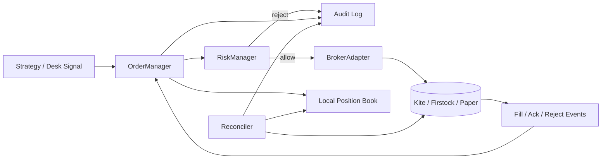
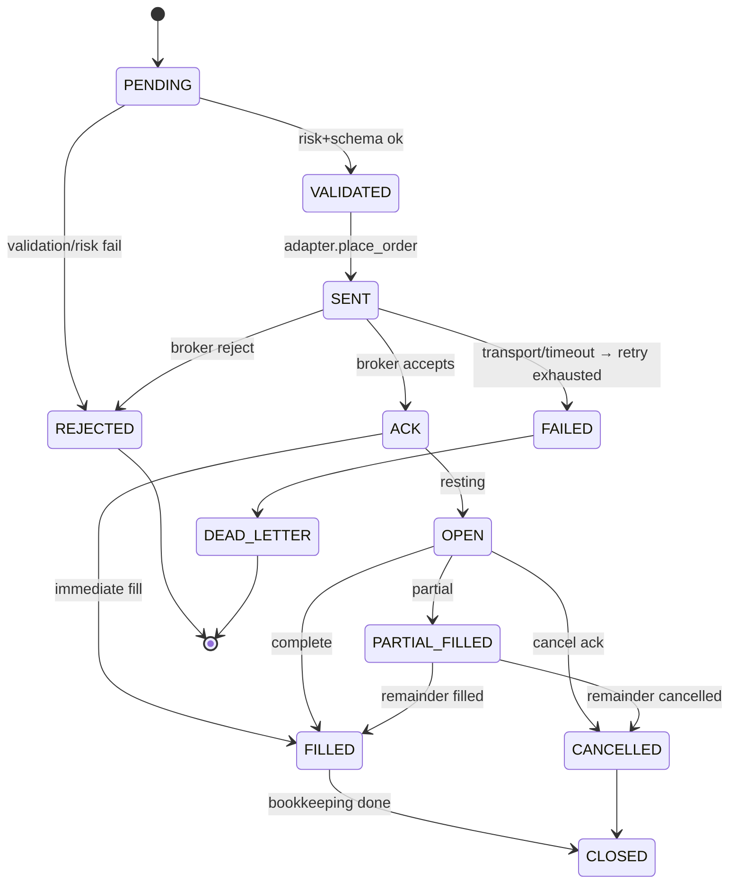
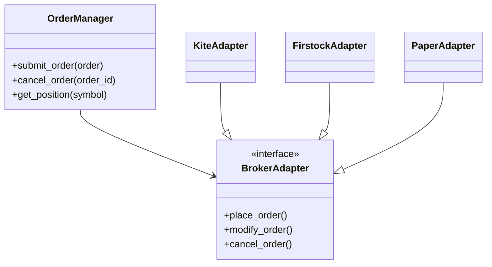

# Live Trading Execution — Design

Design for a dedicated **live order execution module**, separate from the backtest engine. Backtest remains a pure, offline simulator; live trading is an event-driven runtime with broker I/O, risk gates, reconciliation, and an audit trail.

> Status: design only. Existing `broker.*`, `execution.order_executor`, and paper brokers are migration targets, not replaced by this doc.

---

## 1. Architecture Overview

### Goals

- Event-driven order lifecycle (submit → validate → send → fill → close)
- Hard separation from `backtest_engine.py` (no shared position loop)
- Pluggable brokers (Kite, Firstock, Paper) behind one interface
- Pre-trade risk that can block or kill the session
- Observable: every transition is logged and auditable

### High-level flow



### Event-driven loop

A single **execution worker** (async or threaded) consumes an inbound queue:

| Event | Source | Action |
|-------|--------|--------|
| `SubmitOrder` | Strategy / API / desk | Validate → risk → place |
| `CancelOrder` | Desk / risk kill | Cancel at broker |
| `BrokerUpdate` | Poll / websocket | Advance state machine |
| `ReconcileTick` | Timer (e.g. 15–30s) | Sync vs broker positions |
| `RiskTick` | Timer / PnL stream | Circuit breaker / daily loss |

Principles:

1. **Backtest never places orders.** Signals may be shared conceptually; execution paths must not import backtest loops.
2. **Idempotent intents.** Each submit carries a client `request_id`; duplicates are ignored or returned as the original order.
3. **Local book is optimistic; broker is truth.** Reconciliation corrects drift.
4. **Fail closed.** If risk, session, or broker health is unknown → block new risk-increasing orders.

### Suggested package layout (future)

```
execution/live/
  order_manager.py      # OrderManager + state machine
  risk_manager.py       # pre-trade + circuit breaker
  broker_adapter.py     # ABC
  adapters/
    kite.py
    firstock.py
    paper.py
  reconciliation.py
  audit.py
  retry.py
```

---

## 2. Order State Machine

### Happy path

```
PENDING → VALIDATED → SENT → ACK → OPEN → PARTIAL_FILLED → FILLED → CLOSED
```

| State | Meaning |
|-------|---------|
| `PENDING` | Accepted into OrderManager queue; not yet risk-checked |
| `VALIDATED` | Schema / lot / symbol / session checks passed |
| `SENT` | `place_order` invoked; awaiting broker response |
| `ACK` | Broker accepted; order id assigned |
| `OPEN` | Working on exchange (unfilled or restable) |
| `PARTIAL_FILLED` | Some qty filled; remainder still working |
| `FILLED` | Full qty filled; position open (or flat if close order) |
| `CLOSED` | Terminal for this order intent (filled+done, cancelled after fill bookkeeping, or expired) |

### Error / terminal transitions



Notes:

- `REJECTED` — never sent, or broker hard-rejected (no retry for business rejects).
- `FAILED` — infrastructure failure after max retries; payload moved to dead letter queue (DLQ).
- `CANCELLED` — intentional cancel or exchange cancel; still lands in `CLOSED` for audit.
- Same-bar style ambiguity does **not** apply live; exchange timestamps / order updates define truth.

---

## 3. Risk Manager

Runs **before** `SENT` and can also force exits on ticks.

### Pre-trade checks

| Check | Rule (configurable) | On fail |
|-------|---------------------|---------|
| Max daily loss | Realized + unrealized ≤ `-max_daily_loss` | Reject new entries; optional flatten |
| Max open positions | Count of non-zero net symbols/legs ≤ `N` | Reject new entries |
| Max margin usage | Estimated margin / available ≤ `pct` | Reject |
| Session / product | In window, product allowed, kite session valid | Reject |
| Order size | Qty ≤ max qty / lot multiple | Reject |
| Circuit breaker | After `K` consecutive broker errors or kill switch | Halt all new risk |

### Circuit breaker

- **Trip:** broker error streak, daily loss breach, manual kill, reconcile mismatch beyond threshold.
- **State:** `NORMAL` → `HALTED` (block entries; allows reduces-only) → `LOCKED` (no orders except explicit admin).
- **Reset:** manual only for `LOCKED`; auto cool-down optional for transient `HALTED`.

### Interface sketch

```python
class RiskDecision:
    allow: bool
    reason: str
    reduces_only: bool = False

class RiskManager:
    def check_order(self, order: OrderIntent, book: PositionBook) -> RiskDecision: ...
    def on_fill(self, fill: FillEvent) -> None: ...
    def on_pnl(self, pnl: float) -> None: ...
```

---

## 4. Broker Adapter Interface

Abstract base; OrderManager depends only on this.

```python
from abc import ABC, abstractmethod
from typing import Any

class BrokerAdapter(ABC):
    @abstractmethod
    def place_order(self, request: OrderRequest) -> OrderResult: ...

    @abstractmethod
    def modify_order(self, broker_order_id: str, changes: dict[str, Any]) -> OrderResult: ...

    @abstractmethod
    def cancel_order(self, broker_order_id: str) -> OrderResult: ...

    @abstractmethod
    def get_order(self, broker_order_id: str) -> OrderStatus: ...

    @abstractmethod
    def get_positions(self) -> list[Position]: ...

    @abstractmethod
    def get_ltp(self, exchange: str, symbol: str) -> float: ...
```

### Implementations

| Adapter | Role |
|---------|------|
| `KiteAdapter` | Zerodha Kite Connect (live). Reuses egress / session rules from `kite_auth`. |
| `FirstockAdapter` | Firstock API for alternate venue / account. |
| `PaperAdapter` | Simulated fills (see §6). |

Existing `broker.base.Broker` / `KiteBroker` / `PaperBroker` can be wrapped or gradually conformed to `BrokerAdapter`.

### Class diagram



---

## 5. Position Reconciliation

### Purpose

Local book can drift (missed websocket, partial ack, manual trade on Kite). Reconciler is the safety net.

### Loop

1. Every `reconcile_interval_sec` (default 15–30s), call `adapter.get_positions()`.
2. Normalize to `(exchange, tradingsymbol) → signed_qty, avg_price`.
3. Diff vs local book.
4. Classify:
   - **Match** — no action
   - **Soft mismatch** (qty equal, avg differs slightly) — log warning, adopt broker avg
   - **Hard mismatch** (qty differs) — alert, optional HALT, adopt broker qty as truth (configurable)

### Alerts

- Desk UI banner / toast
- Audit log `RECON_MISMATCH`
- Optional: block new entries until acknowledged

### Rules

- Never invent fills to “fix” drift without an audit event.
- Manual broker trades appear as external positions; mark `source=external` in the book.

---

## 6. Paper Trading Mode

Same `BrokerAdapter` interface; no live capital at risk.

### Fill model

1. On `place_order`, read LTP via `get_ltp` (or last tick cache).
2. Apply slippage:  
   - BUY: `fill = ltp * (1 + slip_bps/10000)` or `ltp + slip_pts`  
   - SELL: mirror
3. MARKET → immediate `FILLED` (or configurable latency).  
   LIMIT → fill when LTP crosses; else rest as `OPEN` in the paper book.
4. Update paper positions and emit the same events as live (`ACK`, `FILLED`, …).

### Guarantees

- Identical OrderManager / RiskManager paths as live (only adapter swapped).
- Paper mode flag is explicit in config (`trade_mode=paper`); never silently fall through to Kite.

---

## 7. Error Handling & Retry

### Retry policy (transport / 5xx / rate limit)

- Exponential backoff: `base_ms * 2^attempt + jitter`, e.g. 200ms → 400 → 800 → …
- `max_retries` (default 3) for `SENT` without ACK
- **Do not retry** hard business rejects (invalid token, insufficient margin message after risk already passed — surface as `REJECTED`)

### Dead letter queue (DLQ)

Failed intents after retries go to durable DLQ (`data/execution_dlq.jsonl` or DB):

```json
{
  "request_id": "...",
  "order": { },
  "last_error": "...",
  "attempts": 3,
  "ts": "ISO-8601"
}
```

Ops can replay or discard. Circuit breaker may trip when DLQ rate spikes.

### Timeouts

- Place/modify/cancel: hard timeout (e.g. 10–15s)
- On timeout: query `get_order` by `request_id` / tag before retrying place (avoid double-send)

---

## 8. Logging & Audit

Every order event is append-only with:

| Field | Description |
|-------|-------------|
| `ts` | UTC timestamp |
| `request_id` | Client idempotency key |
| `broker_order_id` | Venue id when known |
| `event` | State transition name |
| `from_state` / `to_state` | State machine edge |
| `payload` | Sanitized request/response (no API secret) |
| `latency_ms` | Optional RTT for broker calls |
| `adapter` | `kite` / `firstock` / `paper` |

### Requirements

- Correlate desk UI “order timeline” with the same `request_id`
- Align with existing `execution/latency_log.py` patterns where possible
- Retention: daily rotate; never log access tokens or `.session_key` material

### Example audit line

```text
2026-07-23T02:40:11Z [INFO] order_audit request_id=a1b2 event=ACK
  PENDING→ACK broker_order_id=230712… adapter=kite rtt_ms=182
```

---

## 9. OrderManager API (target)

```python
class OrderManager:
    def submit_order(self, order: OrderIntent) -> str:
        """Enqueue intent; returns request_id. Async state advances via worker."""

    def cancel_order(self, order_id: str) -> None:
        """Cancel by local id or broker_order_id."""

    def get_position(self, symbol: str) -> Position | None:
        """Local book view (reconciled periodically)."""
```

Dependencies injected: `BrokerAdapter`, `RiskManager`, `AuditLogger`, `Reconciler`.

---

## 10. Implementation Phases (suggested)

1. **Adapter ABC + PaperAdapter** — desk can dry-run full state machine  
2. **OrderManager + audit JSONL** — no strategy coupling  
3. **RiskManager** — daily loss / max positions / kill switch  
4. **KiteAdapter** — wrap current `KiteBroker` / `place_leg_order`  
5. **Reconciler + alerts**  
6. **FirstockAdapter**  
7. **Retire dual paths** — watchlist/premium-book call OrderManager only  

---

## 11. Non-goals (v1)

- Replacing the backtest engine or using live fills inside backtests  
- Full OMS GUI beyond existing desk taskbar  
- Multi-account portfolio netting across brokers  
- Guaranteed HFT / co-lo latency (best-effort RTT logging only)
