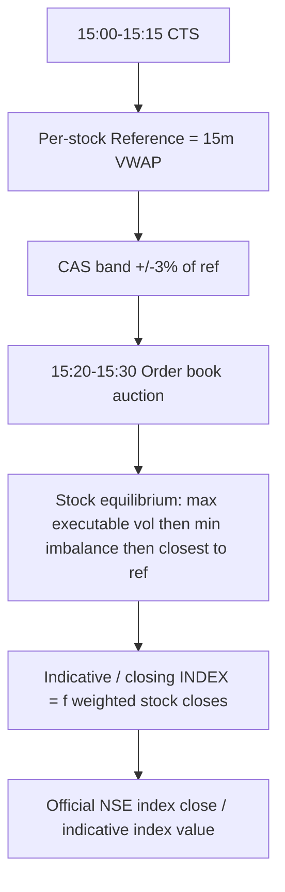

# Plan: CAS Index Estimate (NIFTY-first reverse-engineer)

**Updated:** 2026-08-07  
**Placement:** Hybrid (chips + dedicated `/cas-indicative` page)  
**Ops / how to use:** [README.md](README.md)

---

## Objectives

| # | Goal | Status |
|---|------|--------|
| **1** | **Pre-15:15 close forecast** via Fut LTP + Synth F + VWAP proxies | **In progress / shipping** — see Phase A |
| **2 (later)** | Full Nifty-50 constituent CAS equilibrium rebuild | Scaffold only — not Objective 1 |

---

## What we do **not** do

- Treat raw Kite **index** `indicative_*` as truth without a spot sanity check (live garbage ~15 / ~1866 vs ~24.5k).
- Scrape NSE HTML as a primary feed.
- Feed the estimate into GEX / OI / `require_index_spot`.
- Drive orders / Premium Book from this number.
- Require the CAS window (15:15–15:35) for the desk forecast to appear.

---

## How Nifty close is actually formed (CAS regime)

From SEBI / exchange CAS notes (live from **2026-08-03**):



- CAS discovers **stock** closing prices (F&O cash names), not a separate “Nifty auction book.”
- Exchange disseminates stock indicative equilibrium / imbalance and an **indicative index value** built from those stock indicatives (same free-float / divisor family as normal index math).
- Desk can estimate **before** the official print by:
  1. **Proxy** (Objective 1 / shipped): futures + synth F + pre-close VWAP reference, or
  2. **Rebuild** (later): stock CAS indicatives × Nifty weights / divisor when coverage is high.

---

## Target product (NIFTY-first) — Objective 1

Hero metric on `/cas-indicative` **before 15:15** (and during CAS when official is null):

| Field | Meaning |
|-------|---------|
| **Pre-close forecast** | Desk proxy close — **not** official CAS equilibrium |
| Continuous LTP | Unchanged desk spot |
| Official indicative | Kite/NSE only if sanity-ok; else null (CAS window) |
| Components | Ref VWAP · Fut LTP · Fut POC · Synth F · blend weights · `ref_vwap_window` |

Still **display-only** for GEX/OI math (chips + footer).

### Sanity rule (official)

Reject any parsed Kite index indicative unless:

`abs(indicative - spot) / spot <= 0.03`

Garbage → `indicative = null` / `official_indicative = null` — does not poison Δ / basis-vs-CAS / last-tick cache.

### Phase A — Proxy estimate (`proxy_v1`) — **Objective 1**

`options/cas_estimate.py` attached by `options/cas_indicative.py` (not gated on CAS window):

```text
cas_estimate = 0.40 * synth_F + 0.35 * fut_ltp + 0.25 * ref_vwap
# if synth/fut/ref missing, renormalize remaining weights
# clamp to ref_vwap ± 3% when ref present
```

VWAP ladder (`ref_vwap_window`):

1. `pre_close_1515` — full 15:00–15:15 once `now ≥ 15:15`
2. `running_1500` — 15:00→now while that window is open
3. `session` — 09:15→now when 15:00+ bars are unavailable (morning / early afternoon)

API fields: `estimate`, `estimate_components` (incl. `ref_vwap_window`), `estimate_method: "proxy_v1"`, `official_indicative` (sanitized; `indicative` mirrors it).

### Phase B — Constituent rebuild (`constituent_v1`) — **LATER (scaffold)**

Behind coverage threshold (≥90% weight with valid stock CAS px):

`index_est = Σ(w_i * p_i) / divisor`

`try_constituent_estimate` / `rebuild_index_from_constituents` exist; production stays on `proxy_v1` until a CAS-window **stock-field** spike confirms equity quote fields. No NSE HTML scrape. **Not** Objective 1.

---

## Status vs plan (as of 2026-08-07)

| Plan item | Status | Notes |
|---|---|---|
| Objective 1: estimate before 15:15 | **DONE** | Proxy available outside CAS; adaptive VWAP ladder |
| Sanitize official index indicative | **DONE** | ±3% vs spot in `sanitize_official_indicative` |
| Phase A proxy estimate | **DONE** | `options/cas_estimate.py` + API attach |
| Dedicated page hero = forecast | **DONE** | `/cas-indicative` copy = pre-close forecast |
| Methodology documents formula | **DONE** | UI tab + this PLAN + README |
| Phase B constituent rebuild | **SCAFFOLD / later** | Coverage gate + stub; awaits stock-field spike |
| Chips on Gamma / OI | **DONE** | Still show sanitized official only (display); math on LTP |
| Phase 3 history / sparkline | **NOT DONE** | Optional backlog |
| BANKNIFTY / SENSEX UI | **Stubs only** | Index switcher present |

---

## Remaining backlog

- Next CAS window: spike **equity** quote CAS fields; load Nifty-50 weight/divisor seed; promote `constituent_v1` when coverage ≥ 90% (**Objective 2 / later**)
- Document observed proxy error vs official NSE close (target ~±0.3–0.5%)
- Optional in-window history / sparkline
- BANKNIFTY / SENSEX full desks once feed proven

---

## Retrieve

Ask: *retrieve CAS plan* / *CAS Index Indicative plan*  
Ops day-to-day: [README.md](README.md)
